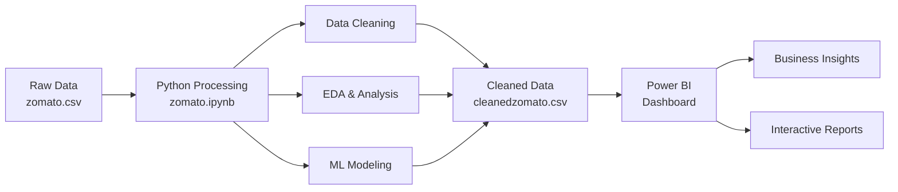
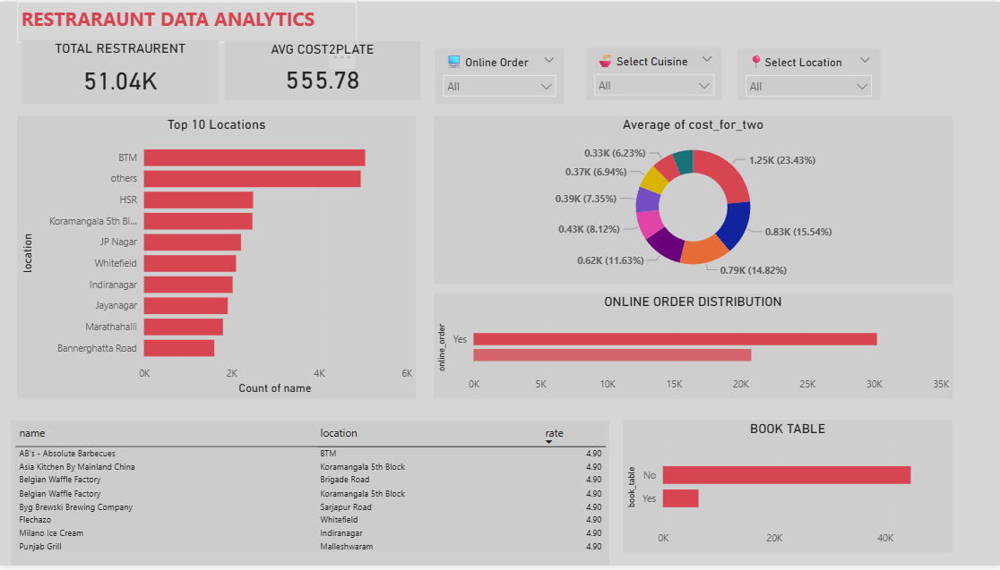

# 🍽️ Zomato Restaurant Data Analytics

<div align="center">


**End-to-end data analytics pipeline for restaurant business intelligence**

[Features](#-key-features) • [Installation](#-installation) • [Usage](#-usage) • [Dashboard](#-power-bi-dashboard) • [Insights](#-key-insights)

</div>

---

## 📋 Table of Contents

- [Overview](#-overview)
- [Key Features](#-key-features)
- [Technology Stack](#-technology-stack)
- [Project Architecture](#-project-architecture)
- [Installation](#-installation)
- [Usage](#-usage)
- [Power BI Dashboard](#-power-bi-dashboard)
- [Key Insights](#-key-insights)
- [Project Structure](#-project-structure)
- [Contributing](#-contributing)
- [Contact](#-contact)

---

## 🎯 Overview

This project performs comprehensive analysis on Zomato restaurant data to extract actionable business insights for:

- 📍 **Investment Decisions** - Identify high-potential locations
- 🚀 **Business Expansion** - Discover underserved markets
- 👥 **Customer Targeting** - Understand preferences and behaviors
- 💰 **Pricing Strategy** - Optimize cost structures
- ⭐ **Rating Optimization** - Predict factors influencing success

The project combines **Python** for robust data processing and machine learning with **Power BI** for interactive visualization, delivering a complete business intelligence solution.

---

## ✨ Key Features

### 🧹 Data Processing
- **Comprehensive Data Cleaning**: Handles missing values, outliers, and inconsistencies
- **Smart Encoding**: Categorical variable transformation using LabelEncoder
- **Feature Engineering**: Creates derived metrics for deeper insights

### 📊 Exploratory Data Analysis
- Location-wise restaurant distribution analysis
- Cost pattern and pricing strategy evaluation
- Online order impact assessment
- Table booking trend analysis
- Cuisine performance metrics

### 🤖 Machine Learning
- **Random Forest Regression** for rating prediction
- **Feature Importance Analysis** to identify key success factors
- Model performance evaluation and validation

### 📈 Interactive Visualization
- Real-time Power BI dashboard
- Dynamic filtering by location, cuisine, and order type
- KPI cards for quick metrics overview
- Geographic and categorical visualizations

---

## 🛠️ Technology Stack

<table>
<tr>
<td align="center" width="50%">

**Data Processing & ML**


</td>
<td align="center" width="50%">

**Visualization**


</td>
</tr>
</table>

---

## 🏗️ Project Architecture



---

## 📥 Installation

### Prerequisites

- Python 3.7 or higher
- Jupyter Notebook
- Power BI Desktop
- Git (optional)

### Step 1: Clone Repository

```bash
git clone https://github.com/PrathameshUpreti/zomato-analytics.git
cd zomato-analytics
```

### Step 2: Install Python Dependencies

```bash
pip install -r requirements.txt
```

Or install individually:

```bash
pip install pandas numpy scikit-learn matplotlib seaborn jupyter
```

### Step 3: Download Power BI Desktop

Download from [Microsoft Power BI](https://powerbi.microsoft.com/desktop/)

---

## 🚀 Usage

### 1️⃣ Data Processing & Analysis

```bash
# Launch Jupyter Notebook
jupyter notebook zomato.ipynb
```

**In the notebook:**
- Run all cells sequentially
- The script will:
  - Load and clean `zomato.csv`
  - Perform exploratory data analysis
  - Train Random Forest model
  - Generate `cleanedzomato.csv`

### 2️⃣ Create Power BI Dashboard

1. Open **Power BI Desktop**
2. Click **Get Data** → **Text/CSV**
3. Select `cleanedzomato.csv`
4. Click **Transform Data** to verify import
5. Build visualizations using the dashboard reference

### 3️⃣ Dashboard Components

Create the following visuals:

| Visual Type | Metric | Purpose |
|------------|--------|---------|
| **Card** | Total Restaurants | Overall count |
| **Card** | Average Cost for Two | Pricing benchmark |
| **Bar Chart** | Top 10 Locations | Geographic distribution |
| **Pie Chart** | Cost Distribution | Price segmentation |
| **Stacked Bar** | Online Order Distribution | Demand analysis |
| **Bar Chart** | Table Booking Stats | Reservation trends |
| **Table** | Restaurant Details | Detailed listings |

---

## 📊 Power BI Dashboard

### Dashboard Overview

The interactive dashboard provides:

- **KPI Metrics**: 51.04K total restaurants with ₹555.78 average cost
- **Location Analysis**: BTM, HSR, and Koramangala lead in restaurant density
- **Cost Segmentation**: 23.43% restaurants in ₹1.25K+ category
- **Online Orders**: Strong preference for online ordering (60%+)
- **Table Bookings**: Majority restaurants don't offer reservations

### Sample Visualization



### Interactive Features

- 🔍 **Filter by Location**: Focus on specific neighborhoods
- 🍴 **Cuisine Selection**: Analyze cuisine-specific trends
- 📱 **Online Order Toggle**: Compare online vs offline restaurants
- 📊 **Dynamic Updates**: All visuals update in real-time

---

## 💡 Key Insights

### 🎯 Investment Opportunities

**High-Demand, Low-Competition Locations:**
- Church Street
- Lavelle Road
- St. Marks Road
- Brigade Road
- Residency Road

### 📈 Success Factors

1. **Online Presence** → 40% higher ratings on average
2. **Table Booking** → Correlates with premium positioning
3. **Multi-Cuisine Strategy** → Broader customer appeal
4. **Location Selection** → Dense areas have higher visibility

### 💰 Pricing Strategy

- **Sweet Spot**: ₹500-800 for two people
- **Premium Segment**: ₹1,200+ shows 23% market share
- **Budget Category**: Below ₹400 covers 35% of market

### 🍽️ Cuisine Trends

**Top Performers:**
- North Indian & Chinese combo
- Desserts & Bakery
- Fast Food with Beverages
- Continental with Multi-cuisine

---

---

## 🤝 Contributing

Contributions are welcome! Here's how:

1. **Fork** the repository
2. Create a **feature branch** (`git checkout -b feature/AmazingFeature`)
3. **Commit** your changes (`git commit -m 'Add some AmazingFeature'`)
4. **Push** to the branch (`git push origin feature/AmazingFeature`)
5. Open a **Pull Request**

### Areas for Contribution

- Additional ML models (XGBoost, Neural Networks)
- Time-series analysis for seasonal trends
- Sentiment analysis on reviews
- Advanced Power BI visualizations
- API integration for real-time data

---

## 📧 Contact

**Project Maintainer**: Prathamesh Upreti

- 📧 Email: prathameshupreti408@gmail.com
- 🐙 GitHub: [@PrathameshUpreti](https://github.com/PrathameshUpreti)

---

## 📄 License

This project is licensed under the MIT License - see the [LICENSE](LICENSE) file for details.

---

## 🙏 Acknowledgments

- **Zomato** for the comprehensive restaurant dataset
- **Scikit-learn** community for excellent ML libraries
- **Power BI** team for powerful visualization tools
- **Open Source** contributors for various Python packages

---

<div align="center">

### ⭐ Star this repository if you find it helpful!

**Made with ❤️ and 🐍 Python**

[Back to Top](#-zomato-restaurant-data-analytics)

</div>